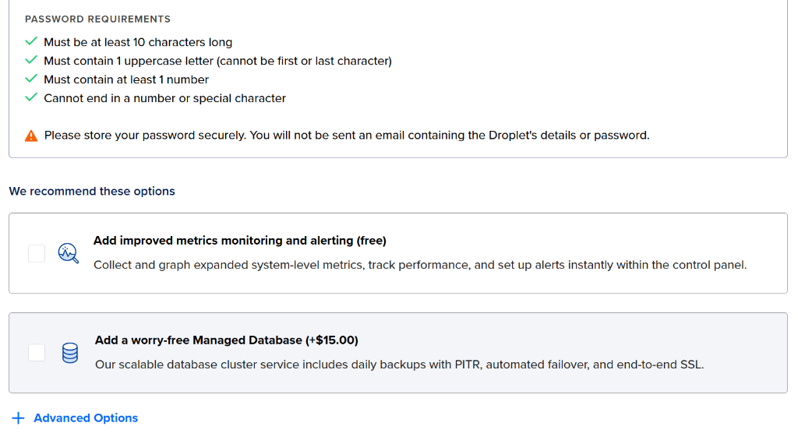
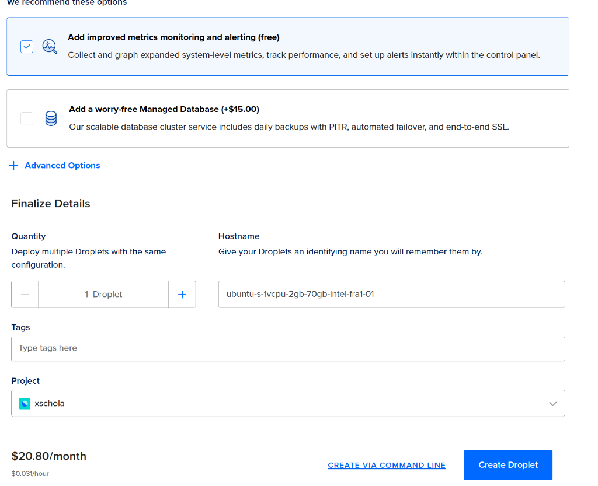
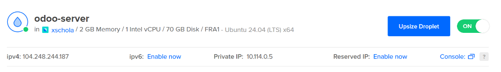
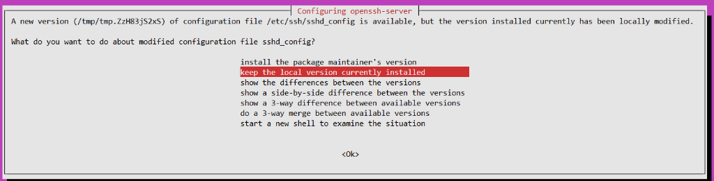
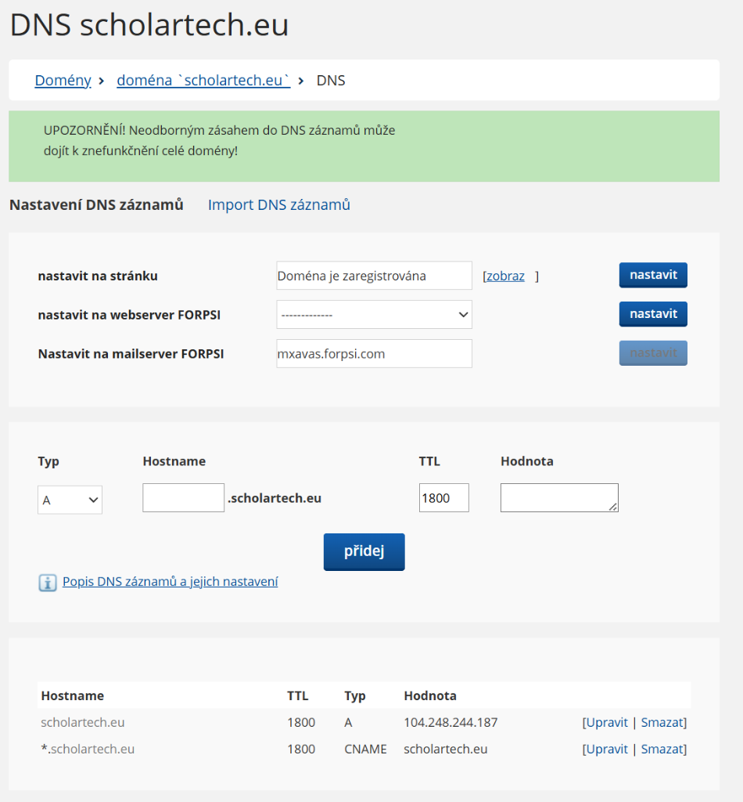
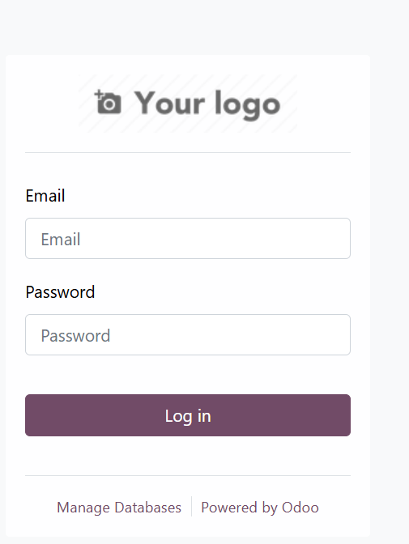

# Dokumentace nasazení Odoo na DigitalOcean (5.2.2026)

Tento dokument zachycuje průběh instalace a konfigurace serveru pro Odoo na DigitalOcean.

## 1. Vytvoření Dropletu

**Konfigurace:**
*   **Image:** Ubuntu 24.04 (LTS)
*   **Plan:** Basic, Regular Disk Type, 2GB RAM / 1 CPU (Premium Intel/AMD)
*   **Region:** Frankfurt (FRA1)
*   **Authentication:** Password (root)
*   **Monitoring:** Zapnuto (Free)
*   **Backups:** Doporučeno (uživatel informován)





**Výsledek:** Server vytvořen.
*   **IP adresa:** `104.248.244.187`
*   **Private IP:** `10.114.0.5`



## 2. Příprava serveru

### Připojení
Proběhlo přes SSH: `ssh root@104.248.244.187`.

### Aktualizace systému
Při `apt update && apt upgrade -y` došlo ke konfliktu konfiguračního souboru `sshd_config`. Zvoleno "keep the local version currently installed".



### SWAP a Firewall
Vytvořen 2GB SWAP soubor a nastaven UFW firewall (povoleny porty 22, 80, 443).

**Výstup z terminálu:**
```text
root@odoo-server:~# fallocate -l 2G /swapfile
chmod 600 /swapfile
mkswap /swapfile
swapon /swapfile
echo '/swapfile none swap sw 0 0' | tee -a /etc/fstab
Setting up swapspace version 1, size = 2 GiB (2147479552 bytes)
no label, UUID=6ad1e51f-8ad5-4a2f-a179-6b180817760f
/swapfile none swap sw 0 0
root@odoo-server:~# ufw allow OpenSSH
ufw allow 80/tcp
ufw allow 443/tcp
ufw enable
Rules updated
Rules updated (v6)
Rules updated
Rules updated (v6)
Rules updated
Rules updated (v6)
Command may disrupt existing ssh connections. Proceed with operation (y|n)? y
Firewall is active and enabled on system startup
```

## 3. Instalace Dockeru

Nainstalován Docker Engine a Docker Compose plugin.
Verze: `Docker Compose version v5.0.2`.

## 4. Nasazení Odoo

Vytvořena struktura `/opt/odoo` a soubor `docker-compose.yml` s kontejnery `web` (Odoo 17) a `db` (Postgres 16).

**Výstup z terminálu po spuštění:**
```text
root@odoo-server:/opt/odoo# docker compose up -d
[+] up 34/34
 ✔ Image postgres:16         Pulled                                                                                                                                                                                      24.8s
 ✔ Image odoo:17.0           Pulled                                                                                                                                                                                      50.0s
 ✔ Network odoo_default      Created                                                                                                                                                                                     0.1s
 ✔ Volume odoo_odoo-web-data Created                                                                                                                                                                                     0.0s
 ✔ Volume odoo_odoo-db-data  Created                                                                                                                                                                                     0.0s 
 ✔ Container odoo-db-1       Created                                                                                                                                                                                     0.3s 
 ✔ Container odoo-web-1      Created    
```

Stav kontejnerů:
```text
root@odoo-server:/opt/odoo# docker compose ps
NAME         IMAGE         COMMAND                  SERVICE   CREATED         STATUS         PORTS
odoo-db-1    postgres:16   "docker-entrypoint.s…"   db        2 minutes ago   Up 2 minutes   5432/tcp
odoo-web-1   odoo:17.0     "/entrypoint.sh odoo"    web       2 minutes ago   Up 2 minutes   127.0.0.1:8069->8069/tcp, 8071-8072/tcp
```

## 5. Doména a Nginx

Doména: **odoo.scholartech.eu**

### Nastavení DNS
Host `scholartech.eu` směruje na `104.248.244.187`.
Nastaven wildcard CNAME `*.scholartech.eu` -> `scholartech.eu`.



### Instalace Nginx
Nainstalován balíček `nginx`, `certbot`, `python3-certbot-nginx`.

### Konfigurace Nginx
Vytvořen soubor `/etc/nginx/sites-available/odoo` s reverzní proxy na port 8069.

**Výstup kontroly konfigurace:**
```text
root@odoo-server:/opt/odoo# nginx -t
nginx: the configuration file /etc/nginx/nginx.conf syntax is ok
nginx: configuration file /etc/nginx/nginx.conf test is successful
```

### SSL Certifikát (Certbot)
Certifikát byl úspěšně vygenerován a nainstalován.

**Výstup z terminálu:**
```text
Requesting a certificate for odoo.scholartech.eu
Successfully received certificate.
Certificate is saved at: /etc/letsencrypt/live/odoo.scholartech.eu/fullchain.pem
Key is saved at:         /etc/letsencrypt/live/odoo.scholartech.eu/privkey.pem
This certificate expires on 2026-05-06.
Deploying certificate
Successfully deployed certificate for odoo.scholartech.eu to /etc/nginx/sites-enabled/odoo
Congratulations! You have successfully enabled HTTPS on https://odoo.scholartech.eu
```

### Diagnostika DNS (klientská strana)
*   **Globální stav:** Ověřeno přes Google DNS (`8.8.8.8`), vrací správnou IP `104.248.244.187`.
*   **Lokální stav:** Zjištěno zpoždění v propagaci u lokálního poskytovatele (ISP), ping stále vrací starou IP `81.2.196.19`.
*   **Řešení:** Vyčkat na vypršení TTL cache nebo dočasně nastavit DNS na 8.8.8.8.
    *   **Tip pro Starlink:** V aplikaci Starlink jděte do *Settings -> Router -> Custom DNS* a nastavte `8.8.8.8` nebo proveďte restart routeru v aplikaci (*Reboot Starlink*), což vyčistí jeho cache.

**Ověření pomocí nslookup:**
```bash
PS C:\Users\spravce\Documents\code\digitalocean> nslookup odoo.scholartech.eu 8.8.8.8  
Server:  dns.google
Address:  8.8.8.8

Non-authoritative answer:
Name:    scholartech.eu
Address:  104.248.244.187
Aliases:  odoo.scholartech.eu
```

## 6. Inicializace databáze
Po úspěšném načtení stránky se zobrazí formulář pro vytvoření první databáze.

**Důležité bezpečnostní a konfigurační pokyny:**
1.  **Master Password:** Toto heslo je automaticky vygenerované (pokud jste ho nenastavili v `odoo.conf`). **Okamžitě si ho uložte do správce hesel.** Budete ho potřebovat pro jakoukoliv budoucí manipulaci s databázemi (zálohování, obnova, mazání).
2.  **Database Name:** Název vaší databáze (např. `scholartech-prod`).
3.  **Email & Password:** Přihlašovací údaje pro prvního uživatele (Administrátora).
4.  **Demo Data:** **NEZAŠKRTÁVEJTE!** Pro produkční prostředí nikdy neinstalujte demo data, těžko se odstraňují.
5.  **Language & Country:** Nastavte `Czech` a `Czech Republic`.

## 7. Odoo login

